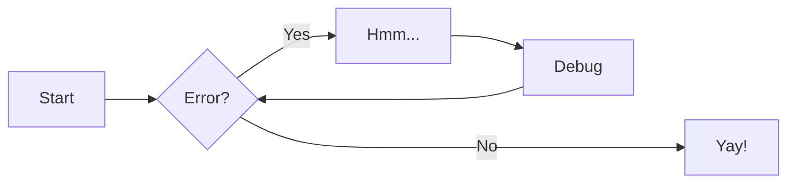
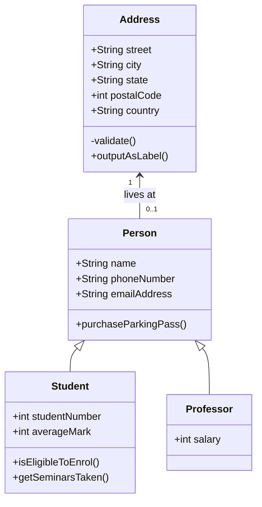

# Funcionalidades

## [:material-gesture-tap-button: Botões](https://squidfunk.github.io/mkdocs-material/reference/buttons/)

[:octicons-markdown-16: Markdown](https://www.markdownguide.org/){ .md-button }

[:octicons-book-16: MkDocs](https://www.mkdocs.org/){ .md-button }

[:octicons-book-16: MkDocks Material](https://squidfunk.github.io/mkdocs-material/reference/){ .md-button .md-button--primary }

## [:material-alert-outline: Chamadas](https://squidfunk.github.io/mkdocs-material/reference/admonitions/)

---

??? note "Sintaxe"

    ``` markdown
    bloco tipo "Título" posição

    Aqui você digita o conteúdo.
    ```

??? info "Blocos"
    ```
    !!!  Bloco Fixo  
    ???  Bloco Inicia Suspenso  
    ???+ Bloco Inicia Expandido  
    ```

??? info "Tipos"  
    - note  
    - abstract  
    - info  
    - tip  
    - success  
    - question  
    - warning  
    - failure  
    - danger  
    - bug  
    - example  
    - quote  

    Se você optar por não escrever um título, retornará o nome da admonition escolhida.

??? info "Posições"
    !!! info inline end

        Você pode criar esses blocos no fim da
        linha usando  
        `!!! info inline end`.

    !!! info inline

        Você pode criar esses blocos no início da
        linha usando  
        `!!! info inline`.

??? example "Exemplos"

    !!! note

        `!!! note`

    ???+ abstract

        `???+ abstract`

    ??? info

        `??? info`

    ??? tip

        `??? tip`

    ??? success

        `??? success`

    ??? question

        `??? question`

    ??? warning

        `??? warning`

    ??? failure

        `??? failure`

    ??? danger

        `??? danger`

    ??? bug

        `??? danger`

    ??? example 

        `??? danger`

    ??? quote

        `??? quote`

## [:material-code-json: Código](https://squidfunk.github.io/mkdocs-material/reference/buttons/)

``` {.sql linenums=1 title="Script de Exemplo" hl_lines=4-6}
SELECT
    a.coluna1
    b.coluna2
FROM tabela AS a
    LEFT JOIN dimension AS b
        ON (a.coluna1 = b.coluna1)
WHERE a.coluna1 IS NOT NULL
GROUP BY 1
ORDER BY 2 DESC
```

## [:material-graph-outline: Diagramas](https://squidfunk.github.io/mkdocs-material/reference/diagrams/)

### :octicons-workflow-16: Fluxos


### :octicons-table-16: UML


## [:material-tooltip-plus: Dica de Ferramenta](https://squidfunk.github.io/mkdocs-material/reference/tooltips/)

:material-information-outline:{ title="Sempre fique atento ao ver esse ícone." }

O HTML é mantido pela W3C.

*[HTML]: Hyper Text Markup Language
*[W3C]: World Wide Web Consortium


## [:material-format-font: Formatação](https://squidfunk.github.io/mkdocs-material/reference/formatting/)

### :material-format-text: Texto

O texto pode ser {--deletado--} e substituído por {++adicionado++}. Isso pode ser feito de forma combinada {~~uma~>simples~~} operação. {==Highlighting==} também é possível {>>e comentários podem ser adicionados<<}.

{==

A formatação também pode ser aplicada aos blocos, colocando a abertura e o fechamento
tags em linhas separadas e adicionando novas linhas entre as tags e o conteúdo.

==}

### :material-format-letter-case: Palavras
- {>>Comentário<<}
- {++Adicionado++}
- {==Marcado==}
- ^^Inserido^^
- ~~Deletado~~

### :material-function-variant: Científico
- H~2~O
- A^T^A

### :simple-amp: Atalhos de Teclado
++ctrl+alt+del++

## [:material-emoticon-happy-outline: Ícones e Emojis](https://squidfunk.github.io/mkdocs-material/reference/icons-emojis/)

:octicons-heart-fill-24:{ .heart } 
:simple-python:
:fontawesome-brands-microsoft:{ .microsoft }
:material-language-csharp:
:simple-dotnet:
:simple-typescript:
:fontawesome-brands-linkedin:{ .linkedin }
:fontawesome-brands-apple:{ .apple }
:fontawesome-brands-instagram:{ .instagram }
:fontawesome-brands-twitter:{ .twitter }
:fontawesome-brands-facebook:{ .facebook }
:fontawesome-brands-whatsapp:{ .whatsapp }

## [:material-image-frame: Imagens](https://squidfunk.github.io/mkdocs-material/reference/images/)

{ align=center }

## [:material-format-list-bulleted: Listas](https://squidfunk.github.io/mkdocs-material/reference/lists/)

:material-directions-fork: Lista Desordenada

- Título 01

    * Item 01
    * Item 02
    * Item 03

:material-order-bool-ascending: Lista Ordenada

1.  Título

    1.  Item
    2.  Item
        1.  Sub Item
        2.  Sub Item
        3.  Sub Item

:material-clipboard-list-outline: Lista de Definição

`Categoria`

:   Descrição Completa da Categoria.

`Características`

:   Descrição Completa das Características.


:octicons-tasklist-16: Lista de Tarefas

- [x] Configurar o MkDocs Material
- [x] Finalizar Documentação
- [ ] Apresentar
    * [ ] Para o Time de Analytics
    * [ ] Para o Grupo de Estudos


## [:material-format-align-bottom: Notas de Rodapé](https://squidfunk.github.io/mkdocs-material/reference/footnotes/)

Você pode usar as Notas de Rodapé[^1] para fazer citações[^2].

## [:material-alphabet-greek: MathJax](https://squidfunk.github.io/mkdocs-material/reference/mathjax/)

$$
\operatorname{ker} f=\{g\in G:f(g)=e_{H}\}{\mbox{.}}
$$

O homomorfismo $f$ é injetivo se e somente se seu kernel é apenas o 
singleton conjunto $e_G$, porque de outra forma $\exists a,b\in G$ com $a\neq b$ de tal forma que 
$f(a)=f(b)$.


## [:material-table-edit: Tabelas](https://squidfunk.github.io/mkdocs-material/reference/data-tables/)

| Métodos      | Descrição                          |
| ----------- | ------------------------------------ |
| `GET`       | Recebe
| `PUT`       | Insere |
| `DELETE`    | Apaga |

[^1]: As notas de rodapé podem ajudar bastante nas documentações.
[^2]: Você pode citar da forma como achar conveniente.
